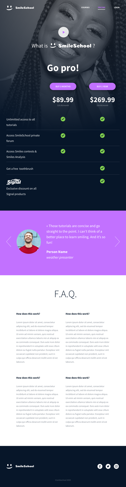

# **Build a web app in JavaScript**
## *Time for JavaScript!*

In this project, you will finalize the previous project [0x0B. Implement a design with bootstrap](https://intranet.hbtn.io/rltoken/oiPG7fxT8IPuYTMm8gbVBw) and make some parts dynamic with Javascript (JQuery exactly).

You will reuse final files of 0x0B. Implement a design with bootstrap and update them.

You will use all HTML/CSS/Accessibility/Responsive design/Bootstrap/Javascript knowledges that you learned previously.

You won’t have a lot of instruction, you are free to implement it the way that you want - the objective is simple: Have fully functional web pages that look the same as the designer file.

# *Here the final result:*

**For Desktop:**

| **Desktop (Landing)**  | **Desktop (Pricing)** | **Desktop (Cources)** |
|--|--|--|
|  |  |  |

**For Tablet:**

| **Tablet (Landing)**  | **Tablet (Pricing)** | **Tablet (Cources)** |
|--|--|--|
|  |  |  |

**For Mobile:**

| **Mobile (Landing)**  | **Mobile (Pricing)** | **Mobile (Cources)** |
|--|--|--|
|  |  |  |

## Requirements

- You have to use Bootstrap
- Your styles.css must be as small as you can - you must use as much as you can Bootstrap classes
- You have to use JQuery
- Your scripts.js must contain all your Javascript part
- Your Javascript must be executed only when the document is loaded

## Tasks

### [0. Reuse and polish your Bootstrap integration](./README.md)

- For this task, please write an amazing README.md.

### [1. Homepage - quotes](./1-homepage.html)

Replace static quotes by dynamic loading:

- URL: https://smileschool-api.hbtn.info/quotes
- No static quotes should be present in the quotes section
- During the Ajax request, a loader should be present
- Carousel should work like before

### [2. Homepage - popular tutorials ](./2-homepage.html)

Replace static video cards by dynamic loading:

- URL: https://smileschool-api.hbtn.info/popular-tutorials
- No static video cards should be present in the section
- During the Ajax request, a loader should be present
- Carousel should work by sliding card by card (like GIF below) - this kind of carousel is not unique, make it generic to reuse it easily!
- Don’t forget the responsive part!

### [3. Homepage - latest videos](./homepage.html)

Replace static video card by dynamic loading:

- URL: https://smileschool-api.hbtn.info/latest-videos
- No static video cards should be present in the section
- During the Ajax request, a loader should be present
- Carousel should work by sliding card by card (like GIF below) - this kind of carousel is not unique, make it generic to reuse it easily!
- Don’t forget the responsive part!

### [4. Pricing - quotes](./pricing.html)

Replace static quotes by dynamic loading:

- URL: https://smileschool-api.hbtn.info/quotes
- No static quotes should be present in the quotes section
- During the Ajax request, a loader should be present
Carousel should work like before

### [5. Courses](./courses.html)

Replace static video card by dynamic loading:

- URL: https://smileschool-api.hbtn.info/courses
  - GET parameters:
    - q: search value (in our case, the value of the field KEYWORDS)
    - topic: topic filter value (in our case, the value of the - field TOPICS)
    - sort: order of all courses (in our case, the value of the field SORT BY)
- No static video cards should be present in the section
- During the Ajax request, a loader should be present
- Dropdowns are dynamic (coming from the API):
    - Topic: list of topics
    - Sort by: list of sorts
- Search value should be initialized by the value q in the API response
- The list of video cards is coming from courses in the API response
- API request must be done when:
    - Search value is changing
    - A new Topic is selected
    - A new Sort by is selected

## Author

**Ivan Dario Lasso Gil** - :email: [Email](mailto:ivan-dario.lasso-gil@holbertonschool.com)

## Licence

Public Domain. No copy write protection.
